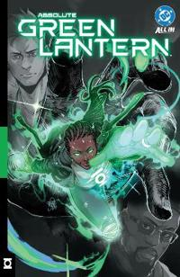

# Absolute-universumi ja Green Lantern

DC:n Absolute Universe -kustannuslinja on ollut huikea myyntimenestys, erityisesti kärkihahmo Batmanin osalta. Green Lantern -sarja kuuluu toiseen aaltoon, jossa Absolute-sarjan avanneiden Batmanin, Wonder Womanin ja Supermanin jälkeen vuoron saavat Green Lantern, Flash ja Martian Manhunter. Myös Green Lantern -sarja on myynyt kohtuullisen hyvin ja keikkunut top 50 -listoilla.

Käsikirjoittaja Al Ewing tunnetaan parhaiten Marvelin puolelta mainiosta *The Immortal Hulk* -sarjasta ja *Ultimates*-sarjasta. Molemmat osoittivat, että Ewing osaa ottaa tutun supersankarigenren ja kääntää sen päälaelleen — Hulkissa kauhun suuntaan, Ultimatesissa kosmisen mittakaavan filosofiaksi. Piirtäjä Jahnoy Lindsay on kanadalaissyntyinen taiteilija, joka on työskennellyt sekä Marvelille (*She-Hulk*, *Luke Cage*) että DC:lle (*Superboy: Man of Tomorrow*). Hänen tyylinsä ammentaa avoimesti mangasta, mikä tekee Absolute Green Lanternista visuaalisesti erottuvan muiden Absolute-sarjojen joukossa.

## Tarina

Evergreenin hiljaiseen pikkukaupunkiin Nevadassa laskeutuu kummallinen monoliitti, joka lähes tuhoaa kaupungin. Kaupungin ympärille muodostuu läpäisemätön vihreä kupu, ja kosminen olento Abin Sur ilmestyy valvomaan sitä ja tuomitsemaan asukkaita. Kaupungin asukkaat — Hal Jordan, John Stewart, Jo Mullein ja Guy Gardner — koittavat kukin selviytyä omalla tavallaan. Jo Mullein nousee tarinan keskushahmoksi: hän on samalla lukijan silmät tässä kaaoksessa ja aktiivinen toimija, joka tekee isoja päätöksiä silloinkin kun kukaan ei ymmärrä mitä tapahtuu.

Ewing on itse todennut valinneensa Jon siksi, että hän tarvitsi hahmon joka voi toimia sekä lukijan samaistumispisteenä että itsenäisenä päätöksentekijänä. Valinta toimii. Jo on riittävän tavallinen ollakseen samaistuttava, mutta riittävän päättäväinen pitääkseen tarinan liikkeessä silloinkin kun kaikki muu on kaaosta.

## Pelko ilman nimeä

Green Lanternin keskeiseksi teemaksi Ewing on nostanut tuntemattoman pelon. Sarjassa se ei näyttäydy vain yliluonnollisena uhkana vaan kosmisena voimana, jota emme edes ymmärrä. Ensimmäiset numerot keskittyvät suurelta osin maailman kuvaamiseen ja kosmisen mittakaavan kauhun asetelman kehystämiseen.

Perinteisessä Green Lantern -mytologiassa sormus toimii tahdonvoiman kautta ja Lantern Corpsin jäsenet ovat avaruuspoliiseja. Ewing riisuu tämän kaiken pois. Ei Corpsia, ei sormusta, ei tahdonvoimaa. Tilalle tulee jotain paljon vieraampaa: Valon Spektri, joka koostuu tasoista nimeltä Qard, Rao, Sur ja Aur, ja joka edustaa erilaisia tietoisuuden tiloja kaaottisesta toiminnasta kohti täydellistä ymmärrystä. Se on kunnianhimoista maailmanrakennusta, ja juuri siksi kiinnostavaa.

Kauhu toimii parhaimmillaan Halin muodonmuutoksessa. Hänen kätensä korruptoituu pimeän energian valtaan, ja lopulta se nielee hänet kokonaan, tehden hänestä hirviömäisen uhan muille. Body horror on intensiivistä, ja Abin Surin tuomioprosessi toimii logiikalla, joka on aidosti vieras ihmisymmärrykselle. Lovecraft-henkistä kosmista kauhua parhaimmillaan.

## Manga Nevadassa

Lindsayn taide ei varsinaisesti jää mieleen hyvässä tai pahassa. Se kuljettaa tarinaa mukavasti ja luo asetelmaa tuntemattomasta uhasta, mutta ei ole samalla tavalla omaperäinen kuin vaikkapa Dragottan työ Absolute Batmanissa tai Janinínin Wonder Womanissa. Tyylin manga-vaikutteet ovat saaneet jonkin verran kritiikkiä lukijoilta — erityisesti hahmojen kasvoilla näkyvät liioitellut ilmeet jakavat mielipiteitä. Parhaimmillaan Lindsay on kauhukohtauksissa, joissa manga-estetiikan dynaamisuus ja kehon vääristymät palvelevat tarinaa erinomaisesti.

## Hitaasti rakentuva palapeli

Vol. 1:n suurin vahvuus ja samalla sen eniten mielipiteitä jakava piirre on sen slow burn -luonne. Kuusi numeroa ovat pitkälti asetelmaa ja maailmanrakennusta. Varsinainen tarina — keitä nämä ihmiset ovat, mitä Valon Spektri todella tarkoittaa, mihin tämä kaikki johtaa — on vasta alkamassa. Kuudes numero on käytännössä pitkä selitysjakso, jossa John Stewart avaa Oan luonnetta ja kosmisia voimia hahmojen kelluesssa tyhjyydessä. Tieto on välttämätöntä laajemman mytologian ymmärtämiseksi, mutta esitystapa on kömpelö.

Tämä on se kohta, jossa lukijat jakautuvat. Jos nautit mysteeristä ja palapelin kokoamisesta — siitä tunteesta, että et tiedä sääntöjä etkä voi ennustaa mitä seuraavaksi tapahtuu — Absolute Green Lantern palkitsee. Jos taas kaipaat selkeää juonta ja nopeaa etenemistä, ensimmäinen volyymi koettelee kärsivällisyyttä.

## Absolute-linjan yllättäjä

Monissa arvosteluissa Absolute Green Lantern on sijoitettu toisen aallon Absolute-sarjoista viimeiseksi. Ymmärrän miksi: se on hitain, vaikeaselkoisin ja visuaalisesti vähiten näyttävä. Mutta olen eri mieltä. Juuri Ewingin kunnianhimo ja rohkeus tehdä jotain aidosti erilaista tekee tästä sarjasta kiinnostavimman.

Absolute Batman on loistava — Snyderin ja Dragottan työ on puhdasta energiaa ja se on ansaitusti linjan lippulaiva. Wonder Woman on vahva mytologinen uudelleentulkinta. Flash hakee vielä suuntaansa. Mutta Green Lantern on ainoa, joka tuntuu aidosti tuntemattomalta. En tiedä mihin tämä on menossa, ja se on parasta mitä tällaiselta sarjalta voi toivoa. Batmanin jälkeen juuri Green Lanternin jatkoa odotan eniten.

**Al Ewing & Jahnoy Lindsay** | *Absolute Green Lantern* #1–6 | DC Comics, 2025

176 sivua. Saatavilla trade paperback- ja kovakantisena versiona.
