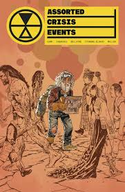

**Deniz Camp, Eric Zawadzki, Jordie Bellaire & Hassan Otsmane-Elhaou** | Image Comics, 2025

Assorted Crisis Events ei ole perinteinen antologia. Jokainen numero on itsenäinen tarina, mutta sarjan logiikka on johdonmukainen: ota tavallinen ihminen tavallisessa tilanteessa ja käännä maailma ympäriltä. Aikasilmukoita, rinnakkaistodellisuuksia, äkillisiä apokalypsejä — mutta kamera pysyy aina ihmisessä, ei ilmiössä. Tämä on ratkaiseva ero. ACE ei ole scifi-sarja jossa tapahtuu ihmeellisiä asioita. Se on sarja tavallisista ihmisistä, joille tapahtuu ihmeellisiä asioita.

Deniz Camp kirjoittaa hahmoja jotka ovat väsyneitä, hukassa ja yrittävät selvitä jo ennen kuin mitään yliluonnollista tapahtuu. Kun bussi kääntyy neoliittiselle kaudelle tai pendelöijä jää jumiin aikasilmukkaan, katastrofi ei ole varsinainen ongelma — se on katalyytti joka paljastaa ongelman joka oli jo olemassa. Perinteinen scifi-antologia (Black Mirror, Twilight Zone) asettaa premissin keskiöön ja rakentaa hahmon sen ympärille. Camp tekee päinvastoin: hahmo on keskiössä ja premissi palvelee hahmoa. Lopputulos on lämmin siellä missä moni antologia on kylmä.

Eric Zawadzkin kuvitus on sarjan toinen kantava voima. Hän sovittaa piirrostyyliään tarinan tunnelmaan tavalla joka hyödyntää antologiamuodon vapautta — jokainen numero näyttää hieman erilaiselta, mutta kokonaisuus pysyy yhtenäisenä. Jordie Bellairen värit sitovat numerot toisiinsa. Bellaire on Eisner-voittaja hyvästä syystä: hänen värityönsä ei ole pelkkä päällemaalaus vaan narratiivinen työkalu joka ohjaa lukijan huomiota ja rakentaa tunnelmaa. Erityisesti sivutaitot ansaitsevat huomion — Camp ja Zawadzki käyttävät sarjakuvamediumin mahdollisuuksia tavalla joka ei kääntyisi televisioon tai proosaan. Tämä on sarjakuvaa joka ei voisi olla mitään muuta.

Sarjan nimi on ironinen ja tarkka. "Assorted crisis events" kuulostaa vakuutusyhtiön lomakkeelta tai uutiskanavan alaotsikoinnilta — byrokraattista kieltä sovellettuna eksistentiaalisiin katastrofeihin. Tämä on sarjan ydinajatus tiivistettynä kahteen sanaan: elämme maailmassa jossa kriisi on arkipäiväistynyt, ja Camp kääntää arkipäiväistymisen kirjaimelliseksi. Maailmanloppu tulee ja ihmiset reagoivat kuin kyseessä olisi myöhästynyt bussivuoro. Se on hauskaa ja surullista samaan aikaan, koska se on totta.

Antologiamuodolla on rajansa. Jokainen numero aloittaa alusta uusilla hahmoilla, mikä tarkoittaa että yhteys lukijan ja hahmon välillä rakennetaan aina uudelleen muutamassa kymmenessä sivussa. Jotkut premissit kantavat paremmin kuin toiset. Sarja ei tarjoa jatkuvaa narratiivista koukkua — se vaatii lukijalta kiinnostusta muotoon ja temaattiseen kokonaisuuteen yksittäisen tarinakaaren sijaan. Se ei ole heikkous sinänsä, mutta se rajaa yleisöä.

