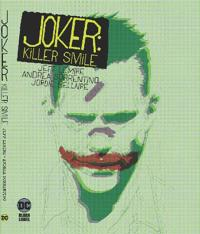

**Jeff Lemire & Andrea Sorrentino** | DC Black Label, 2019–2020

Jokeri-tarinoita on niin paljon, että uuden pitää ansaita olemassaolonsa. The Killing Joke määritteli hahmon vuosikymmeniksi eteenpäin. A Death in the Family — oma Batman-suosikkini — osoitti mitä tapahtuu kun Jokeri kohdistaa väkivaltansa johonkuhun, jota Batman ei ehdi pelastaa, ja muutti sarjan suunnan vuosikymmeniksi. Molemmat kertovat Jokerista suhteessa Batmaniin: vastustajina, peileinä, toistensa välttämättömyyksinä.

Jeff Lemiren ja Andrea Sorrentinon Joker: Killer Smile tekee jotain erilaista. Se siirtää Batmanin lähes kokonaan pois kuvasta ja kysyy: mitä Jokeri tekee tavalliselle ihmiselle?

Tohtori Ben Arnell on Arkhamin psykiatri, joka uskoo voivansa diagnosoida ja parantaa Jokerin. Premissi on tuttu vaikka Uhrilampaista, mutta Lemire ei ole kiinnostunut älykkään rikollisen ja nuoren tutkijan pelistä. Arnellia ei vedä puoleensa Jokerin karisma vaan rationaalinen mutta inhimillinen vakaumus siitä, että hulluus on sairaus joka voidaan hoitaa. 

Tarinan nsimmäiset sivut ovat lähes arkisia: Arnell istuu vastaanotollaan, puhuu Jokerille, menee kotiin perheensä luokse. Pian saumat alkavat rakoilla. Pienet yksityiskohdat muuttuvat: jokin Arnellin pojan piirustuksissa, jokin hänen vaimonsa ilmeissä, jokin Arkhamin käytävillä. Lemire annostelee epävarmuutta tarkasti, ja lukijana ei ole koskaan varma onko kyse Jokerin manipulaatiosta, Arnellin omasta hajoamisesta, vai jostain kolmannesta.

Tässä kohtaa Andrea Sorrentino tekee uransa parasta työtä. Sivutaitot ovat Killer Smilen todellinen kieli — tapa jolla tarina kertoo sen mitä dialogi ei sano. Paneelit muuttuvat Arnellin mielen mukana ja alun siistit ruudukot hajoavat spiraaleihin, kuutioihin, hammasriveihin. Yhdellä sivulla Arnellin kasvo pilkkoutuu kymmeniin pieniin laatikoihin, joista jokainen näyttää eri vaiheen huutavasta suusta. Toisella sivulla paneelit muodostavat Jokerin hymyn. Jordie Bellairen alkuun hillitty ja kliininen paletti muuttuu ja värit vuotavat reunojen yli sitä mukaa kuin Arnellin maailma murtuu.

Lemiren Jokeri on tässä tarinassa enemmän voima kuin hahmo. Hän on kuin tartunta tai psykologinen tila, joka leviää ihmisestä toiseen ja saa heidät vahingoittamaan niitä joita he rakastavat. Hulluus hienovaraista ja pelottavaa.

Jokeritarinoiden kaanon on pitkä, ja kynnys siihen pääsemiseen on korkea. The Killing Joke, A Death in the Family, Death of the Family, Joker (Azzarello/Bermejo) joista jokainen on löytänyt oman kulmansa hahmoon. Killer Smile ansaitsee paikkansa siinä joukossa. Se löytää Jokerista jotain mitä muut eivät ole käsitelleet yhtä puhtaasti: ajatuksen siitä, että Jokerin todellinen ase ei ole myrkkykaasu tai dynamiitti vaan kyky saada toinen ihminen näkemään maailma hänen tavallaan.

Lemire ja Sorrentino ovat tehneet yhdessä erinomaista työtä aiemminkin, mutta Killer Smile on heidän yhteistyönsä terävimmässä kärjessä.
