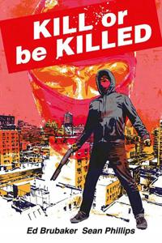

**Ed Brubaker, Sean Phillips & Elizabeth Breitweiser** | Image Comics, 2017

Ed Brubaker ja Sean Phillips ovat tehneet yhteistyötä niin pitkään, että heidän teoksistaan on alkanut muodostua oma lajityyppinsä. Criminal, Fatale, Pulp, Where the Body Was. Kaikki ovat noiria, mutta jokainen löytää siihen eri kulman. Kill or Be Killed kertoo tarinan, jossa päähenkilö saa yliluonnollisen motiivin tappaa.

Dylan on masentunut maisteriopiskelija New Yorkissa. Hän yrittää itsemurhaa, epäonnistuu, ja herää sairaalasta. Kotiuduttuaan hän kohtaa demonin, joka kertoo hänelle säännöt. Tapa yksi ihminen kuukaudessa tai kuole itse. Dylan ei tiedä onko demoni todellinen vai hänen mielensä tuote — eikä sillä lopulta ole väliä, koska seuraukset tuntuvat todellisilta.

Dylanin ääni on teoksen selkäranka. Hän kertoo tarinaansa ensimmäisessä persoonassa, suoraan lukijalle, ja Brubaker kirjoittaa hänet tavalla joka on samaan aikaan itsetietoinen ja epäluotettava. Dylan analysoi omia tekojaan, rationalisoi niitä, ja tietää rationalisoivansa — mutta ei pysty lopettamaan. Psykologinen ote on harvinaisen terävä. Kill or Be Killed kaivaa syvälle päähenkilön sisäiseen maailmaan.

Sean Phillipsin taistelukohtaukset ovat tämän teoksen kohokohtia — ja rehellisesti sanottuna parasta sarjakuvaa mitä olen lukenut pitkään aikaan. Väkivalta on raakaa ja hallittua, koreografioitua. Toimintakohtauksista rakentuu intensiivisiä ja rytmikkäitä sekvenssejä joissa jokainen paneeli vie tilannetta eteenpäin. New York on kuten pitää: likainen, öinen ja klaustrofobinen.

Mutta Phillips ja Brubaker osaavat myös hiljaiset hetket. Dylanin matka lapsuudenkotiin äitinsä luo on kauniisti kerrottu jakso, jossa tempo hidastuu ja teos hengittää. Sivut vaihtuvat toiminnan kireydestä johonkin pehmeämpään ja surullisempaan, ja juuri tämä vaihtelu tekee Kill or Be Killedistä rikkaamman kuin pelkkä vigilante-tarina. Elizabeth Breitweiserin väritys kantaa molempia rekistereitä — demonin kohtaukset ovat kylmiä ja sinisiä, arkimaailma hehkuu kellastuneena ja epäterveenä, ja lapsuudenkodin kohtauksissa on lämpöä joka tekee kontrastista entistä terävämmän.

Ensimmäisen albumin suurin vahvuus on sen kieltäytyminen antamasta helppoja vastauksia. Onko demoni todellinen? Ansaitsevatko uhrit kohtalonsa? Onko Dylan sankari, hullu vai molempia? Brubaker jättää kaikki nämä kysymykset avoimiksi, ja tekee sen tavalla joka ei tunnu huijaamiselta vaan tietoiselta valinnalta. Tarina ei moraliso vaan esittää tilanteen sellaisena kuin se on ja pakottaa lukijan kohtaamaan epämukavuuden.

Heikkoudet ovat pieniä. Dylanin kolmiodraama opiskelukavereidensa kanssa tuntuu paikoin konventionaaliselta suhteessa teoksen muuten jännitteiseen otteeseen. Romanttinen juonilinja kyllä palvelee Dylanin hahmoa näyttämällä hänen kyvyttömyytensä toimia normaalien ihmissuhteiden puitteissa, mutta sivumäärä jota siihen käytetään tuntuu suuremmalta kuin sen painoarvo.

Kill or Be Killed vol. 1 on Brubakerin ja Phillipsin kiinnostavimpia ja parhaita töitä. Se on älykkäämpi kuin tyypillinen vigilante-tarina, rohkeampi kuin tyypillinen Brubaker-noir, ja visuaalisesti heidän terävin yhteistyönsä. Taistelut, tunnelma, psykologia — kaikki toimii. Jatko-osia odottaa malttamattomana.
