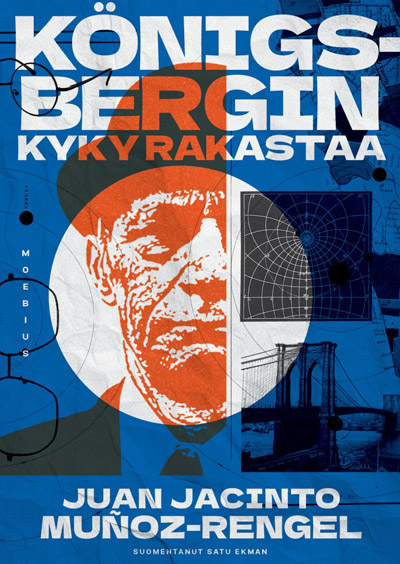

**Juan Jacinto Muñoz-Rengel: Königsbergin kyky rakastaa** (*La capacidad de amar del señor Königsberg*). Suom. Satu Ekman. Moebius, 2025. 159 s.

Paul Königsberg herää joka aamu samalla kellonlyömällä, pureskelee jokaista suupalaa kaksikymmentäneljä kertaa, pukeutuu huolellisesti, painaa knallin päähänsä ja kävelee töihinsä. Seikkailunhalunsa hän tyydyttää vaihtelemalla kävelyreittiään. Toimistolla hän on joka kuukausi kuukauden työntekijä, ja avokonttorin keskikäytävä on täynnä hänen kuukauden työntekijä -kuviaan. Kollegat pitävät häntä omituisena ja raivostuttavan värittömänä.

Königsberg ei rakasta työtään. Hänet pitää käynnissä velvollisuudentunto ja hiljaa podettu rakkaus käytävän toisella puolella työskentelevää Doris Hillmania kohtaan. Luonnollisesti hän ei ole koskaan vaihtanut sanaakaan Hillmanin kanssa.

Sitten ulkoavaruuden olennot saapuvat. Ihmiset alkavat kadota. Doris Hillman katoaa. Maailma luhistuu. Königsberg ei luovu rutiineistaan.

Muñoz-Rengelin romaani alkaa kuin satiiri ja muuttuu joksikin aivan muuksi. Se on kirja joka vaihtaa genreä luvusta toiseen — realismi, alien-invaasio, apokalypsi, road-tarina, jotain mikä muistuttaa feminististä utopiaa — eikä koskaan varoita etukäteen. Espanjalaiset arvostelijat korostivat juuri tätä: jokaisen luvun jälkeen on mahdotonta ennustaa seuraavaa. Genrehyppely toimii, koska Königsberg itse on vakio. Hänen ympärillään kaikki muuttuu, mutta hän pureskelee edelleen kaksikymmentäneljä kertaa.

Königsbergin nimi ei ole sattuma. Königsberg — nykyinen Kaliningrad — oli Immanuel Kantin kotikaupunki. Kant oli kuuluisa kellontarkoista kävelyretkistään, ja hän toi filosofiaan kategorisen imperatiivin: toimi niin kuin tekosi voisi olla yleinen laki. Paul Königsberg elää kirjaimellisesti näin. Hän on pyrkinyt elämään jokaisen hetken niin kuin olisi viimeinen mies maan päällä, ja kun hän todella on lähes viimeinen mies maan päällä, periaate ei murru vaan kantaa.

Tässä on kirjan ydinoivallus. Velvollisuudentunto ei ole este rakkaudelle vaan sen edellytys. Kun tarina vie Königsbergin tilanteeseen jossa hänen kykyään rakastaa todella kysytään — jossa vastuu toisesta ihmisestä ohittaa kiveenhakatut tottumukset — hänet pelastaa juuri se, minkä luulisi olevan hänen heikkoutensa. Pakkomielteinen järjestelmällisyys kääntyy kyvyksi toimia kun kaikki muut ovat lamaantuneet. Se on hauska ja koskettava käänne, koska se ei tule tyhjästä: Muñoz-Rengel on rakentanut sen 150 sivun ajan.

Helsingin Sanomien arvostelu tulkitsi romaania kapitalismisatiirina ja luki alieneja maahanmuuttajametaforana. Nämä luennat ovat mahdollisia — Königsberg on toki konemaisessa työssä ja alienit ovat vieraita — mutta ne eivät ole kirjan vahvinta antia. Muñoz-Rengel ei rakenna systemaattista allegoriaa. Hän rakentaa farssin, jossa maailmanloppu on väline hahmotutkielmalle. Königsbergin rutiinit eivät ole kapitalismin tuote vaan persoonallisuuden piirre: hän olisi täsmälleen samanlainen missä tahansa talousjärjestelmässä. Ja alienien pointti on nimenomaan olla käsittämättömiä — "eteerisiä, tahmaisia olentoja" jotka eivät palaudu mihinkään tuttuun kategoriaan. Kun ne pakotetaan vertauskuvaksi jostakin tunnistettavasta, kirjan outoutta kesytetään tavalla joka ei palvele sitä.

Romaani on kommentti kokonaiselle genreperheelle. Siinä missä postapokalyptiset tarinat yleensä kysyvät miten selviydytään — mitä taitoja tarvitaan, millainen johtaja pärjää — Muñoz-Rengel kyseenalaistaa koko kysymyksenasettelun. Königsberg ei selviä koska hän on vahva, fiksu tai sopeutuvainen. Hän selviää koska hän on niin perusteellisesti oma itsensä, ettei maailmanloppu pysty muuttamaan häntä. Se on absurdi premissi, ja kirja tietää sen. Königsberg on sankari joka on läpeensä naurettava, ja juuri pienuuden ja suuruuden yhdistelmä tekee hänestä unohtumattoman.

Satu Ekmanin suomennos soljuu ja pitää yllä romaanin kevyttä, tarkkaa sävyä. 159 sivua riittää. Muñoz-Rengel ei tuhlaa yhtään niistä.
