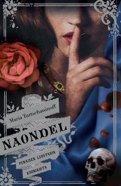

**Maria Turtschaninoff: Naondel.** Tammi, 2016. 

Maria Turtschaninoffin Maresi (2014) kertoi Punaisesta luostarista, naisten turvapaikasta saarella maailman laidalla. Finlandia Junior -palkittu romaani rakensi paikan jossa tytöt ja naiset saivat opiskella, kasvaa ja elää vapaana. Naondel kertoo miten paikka syntyi.

Naondel on esiosa. Se vie lukijan vuosisatojen taakse ja kertoo Ensimmäisistä sisarista, naisista jotka pakenivat ja perustivat luostarin. Ennen pakoa naiset ovat Iskanin haaremissa.  Iskan kerää naisia kuin esineitä: ostaa, varastaa, nai väkisin. Hän abortoi tyttäret ja kasvattaa pojat omikseen. Vuosikymmenet kuluvat, ja naisia tulee lisää.

Turtschaninoff kertoo tarinan näiden naisten äänillä vuorotellen. Kabira, joka tunsi Iskanin ennen kuin hänestä tuli hirviö. Garai, pyhien paikkojen vartija. Orseola, unenrakentaja. Sulani, soturi jonka voiman lähde on tuhottu. Jokainen kertoo ensimmäisessä persoonassa, ja jokainen tuo mukanaan oman kulttuurinsa, uskontonsa ja historiansa.

Moniääninen kerronta on kirjan suurin tekninen saavutus. Vaihto näkökulmasta toiseen ei tunnu mekaaniselta tempulta vaan luonnolliselta liikkeeltä, koska jokainen ääni on aidosti erilainen. Kabiran kerronta on sisäänpäin kääntynyttä ja sävyltään turtunutta. Vuosikymmenien väkivalta on tehnyt hänestä jonkun, joka katsoo omaa elämäänsä etäältä. Sulani on suora ja fyysinen, kun taas Orseolan luvut unenomaisia. Tarinassa on todella viisi naista, joiden kokemukset vankeudesta ja alistamisesta ovat erilaisia.

Kirjan feminismi toimii, kosa Naondel ei julista vaan näyttää. Se ei kerro lukijalle miltä patriarkaalinen väkivalta tuntuu vaan antaa viiden naisen kokea ja kertoa se omin sanoin, eri kulmista. Kabira tuntee syyllisyyttä koska hän näytti Iskanille lähteen. Garai kantaa vastuuta pyhien paikkojen menettämisestä. Kukaan heistä ei ole pelkkä uhri, mutta kukaan ei myöskään pääse väkivallan seurauksista. Kirjan äitiyteen liittyvät traumat — lasten menettäminen, lasten varastaminen, pakko synnyttää —  ovat kirjan raskaimpia ja vaikuttavimpia kohtauksia.

Juoni kulkee käänteineen mainiosti ja rakentuuu hiljalleen kohti pakoa. Naisten on ensin opittava luottamaan toisiinsa vaikka Iskan on vuosikymmeniä pelannut heitä toisiaan vastaan. Kun suunnitelma alkaa hahmottua, tempo kiihtyy ja juonenkäänteet seuraavat toisiaan tavalla joka pitää otteessaan. 

YA-kirjaksikin luonnehdittu Naondel on rankka tarina. Seksuaalinen väkivalta on jatkuvaa, vaikka Turtschaninoff kirjoittaa sen vihjaten eikä graafisesti. Kokonaisuutena Naondel on vaikuttava teos. Turtschaninoff on suomalaisen fantasian merkittävimpiä ääniä, ja Naondel on hänen terävintä työtään.
