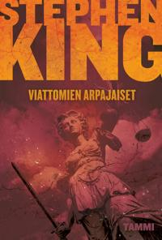

**Stephen King: Viattomien arpajaiset** (*Never Flinch*). Suom. Ilkka Rekiaro. Tammi, 2026. 423 s.

Stephen Kingin Holly Gibney on outo sankari. Neurokirjolla oleva yksityisetsivä, joka itsenäistyi viisikymppisenä painostavan äitinsä varjosta, ei ole supersankari eikä yritäkään olla. Hänen supervoimansa on kyky sulautua väkijoukkoon. Mersumies-trilogian sivuhenkilönä aloittanut Holly on kasvanut neljässä omassa romaanissaan Kingin myöhäiskauden keskeisimmäksi hahmoksi — Slaten kriitikko kutsui häntä "Kingin myöhäiskauden kukaksi ja hänen rikosfiktionsa parhaaksi saavutukseksi."

Viattomien arpajaisissa Holly operoi kahdella rintamalla. Etsivä löytää -toimisto saa keikan suojella Kate McKayta, sanavalmista feministiä ja naistenasia-aktivistia, jonka kirjakiertue lähestyy Keskilänttä. Samaan aikaan Hollyn ystävä, rikosetsivä Izzy Jaynes selvittää Buckeye Cityn "sijaismurhia" — joku rankaisee oikeuslaitoksen puolesta väärillä tuomioilla vapautettuja. Molemmat juonilinjat johtavat samaan superviikonloppuun, jossa McKayn puhujankeikka ja Sista Bessien comeback-konsertti tarjoavat lavastuksen väistämättömälle kliimaksille.

## Kulttuurisota näyttämönä

Kirjan todellinen aihe ei ole kumpikaan rikostarina vaan Amerikan polarisaatio. King asettaa vastakkain kaksi fanaattisuuden muotoa: abortinvastustajat jotka seuraavat McKayn jokaista askelta, ja McKayn itsensä, joka kyykyttää alaisiaan ja pitää listaa myötämielisistä toimittajista. Holly liikkuu näiden välissä tarkkailijana — ei neutraalina, mutta empaattisena molempiin suuntiin. Kingin sympatiat ovat selvät: hän on progressiivi, joka kritisoi fundamentalismia. Mutta hän ei tee McKaysta pyhimystä. Slaten arvostelija huomasi saman: McKay on "Hollyn todellinen vastakohta — karismaattinen ja oikeiden asioiden puolella, mutta myös tuntemattomasti itsekeskeinen tavalla joka kuuluu kuuluisuudelle."

Tämä tasapainoyritys on Viattomien arpajaisten kiinnostavin ja samalla ongelmallisin piirre, ja juuri tästä amerikkalainen kritiikki jakautui selvästi.

## Miten Amerikka luki politiikan

Vastaanotto halkesi ennustettavasti mutta kiinnostavalla tavalla.

**Valtavirtakritiikki** otti kirjan vastaan varauksellisella hyväksynnällä. Kirkus kehui toiminnan rytmiä ja Kingin päätöstä käsitellä ekstremistisen ajattelun todellisia vaaroja, mutta totesi hahmojen jäävän kliseisiksi ja dialogin paikoin kuluneeksi. Washington Post kehui Hollyn hahmoa. New York Timesin Ainslie Hogarth kiitti Kingin hyveellisyyden kritisointia — siis kumpaankin suuntaan kohdistuvaa.

**Konservatiivinen kritiikki** oli suorapuheisempaa. Catholic World Reportin arvostelija Anne Hendershott kirjoitti, että King "on tehnyt politiikasta uuden uskontonsa" ja tuotti kirjan "jäykäksi poliittiseksi manifestiksi, joka tuntuu enemmän woke-julistukselta kuin matkalta inhimilliseen kokemukseen." Kritiikki kohdistui erityisesti kristillisten hahmojen kuvaukseen, jonka Hendershott koki systemaattisena pilkkana.

**Fanipohjainen kritiikki** Goodreadsissä ja muualla nosti esiin toistuvan teeman: "saarnaavuuden." Osa lukijoista koki Kingin poliittisten kantojen painavan tarinankerronnan alleen. King itse myönsi jälkisanoissa, ettei kyseessä ole hänen paras romaaninsa.

Mutta kiinnostavin kritiikki tuli progressiiviselta puolelta. Useampi arvostelija huomautti, että kirjoittajalle joka on yhä äänekkäämpi sosiaalisen oikeudenmukaisuuden puolestapuhuja, Kingin queer-hahmojen kuvaus on yhä turhauttavaa. Never Flinchin Christopher Stewart — ristiinpukeutuva, äitiinsä pakkomielteisesti kiinnittynyt, Raamattua heiluttava stalkkeri — yhdistää sukupuolen moninaisuuden, skitsofrenian ja uskonnollisen trauman tavalla, joka tuntuu vanhanaikaiselta.

## Mitä jää käteen

Dekkarina Viattomien arpajaiset hajoaa turhan moneen suuntaan. Lyhyet luvut ja näkökulmien jatkuva kieputus tuntuvat tv-sarjan pohjustukselta. Loppurymistelyssä on aiempien osien kierrätyksen makua. Mutta poliittisena romaanina se on kiinnostavampi kuin rikosromaanina.

Kingin Amerikassa on edelleen hyvää tahtoa. Hollyn ympärille rakennettu yhteisö — Jerome, Barbara, Izzy, Sista Bessie — edustaa epäpoliittista tekemisen meininkiä, joka on Kingin nostalgisin ja vilpittömin piirre. Poliisin ja palolaitoksen softball-hyväntekeväisyysottelu on pieni yksityiskohta, mutta se kertoo enemmän Kingin maailmankuvasta kuin mikään poliittinen juonilinja.

Ongelmana on, että King haluaa kirjoittaa samaan aikaan kulttuurisotaromaania ja viihteellistä dekkaria, ja nämä tavoitteet syövät toisiaan. McKayn kiertueen kohtaukset ovat parasta Kingiä: tarkkaa havaintoa, absurdia huumoria ja aidosti jännittäviä tilanteita. Sijaismurha-juonilinja on mekaanisempaa työtä. Yhdessä ne tuottavat romaanin, joka on kiinnostava mutta hajanainen.

Holly Gibneyn vetovoimasta kertoo kuitenkin se, että hän kantaa tämänkin kirjan. Harmaantuva hissukka joka navigoi Amerikan kulttuurisotaa empatia edellä — se on rooli, jolle on tilausta. Kingin vastaus polarisaatioon ei ole tasapuolisuus vaan kiltteys, ja siinä on jotain vanhanaikaista ja vetoavaa. James Gunnin Superman julisti kiltteyden uudeksi punkiksi. King sanoo saman, mutta hiljaisemmin.
